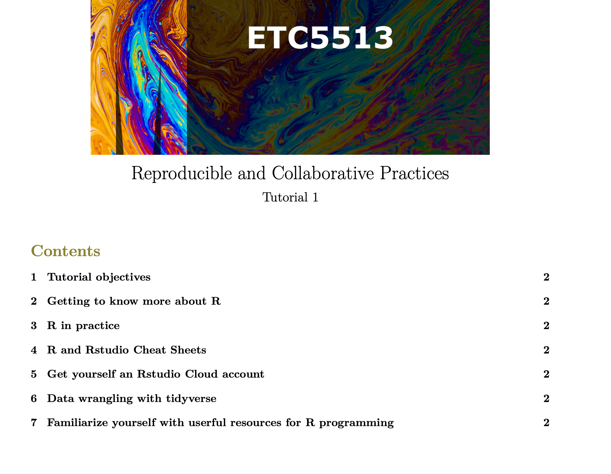
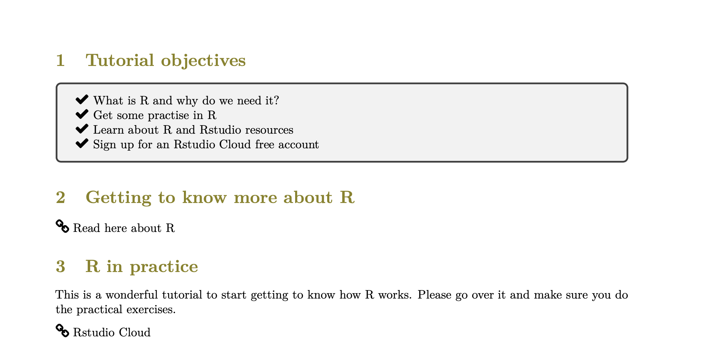
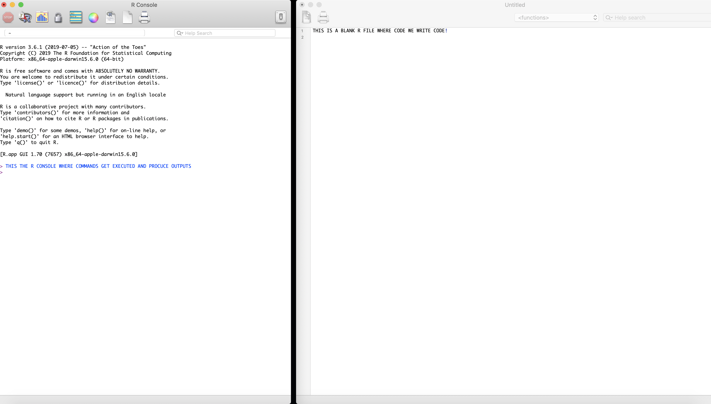
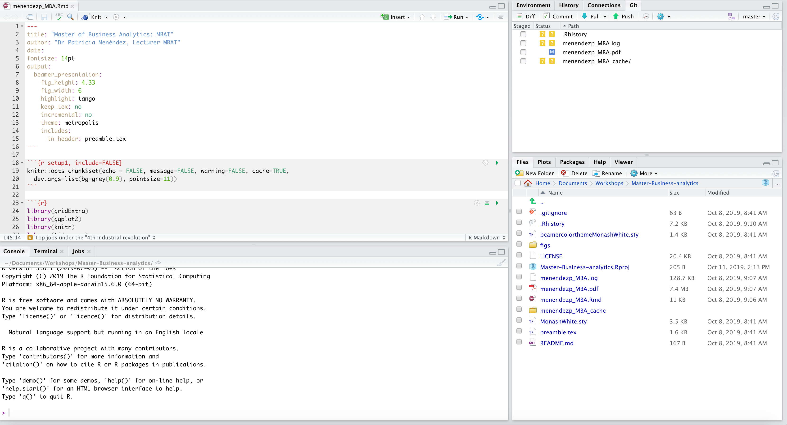
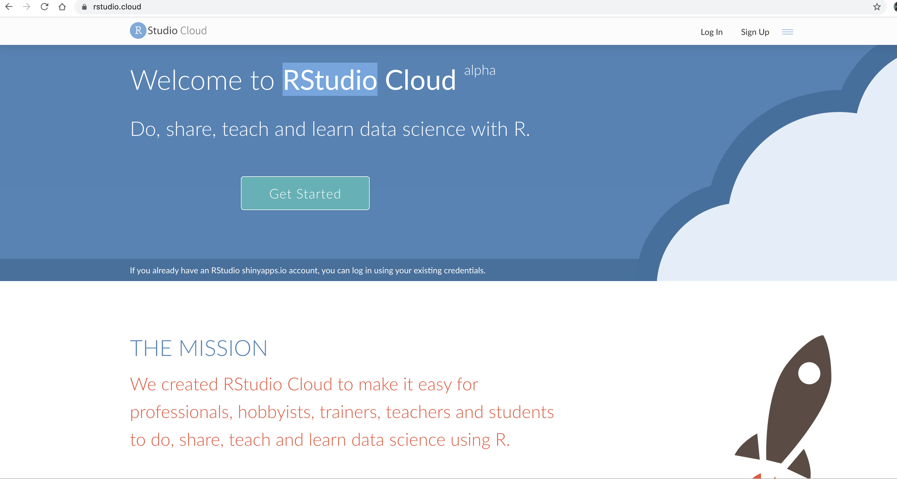
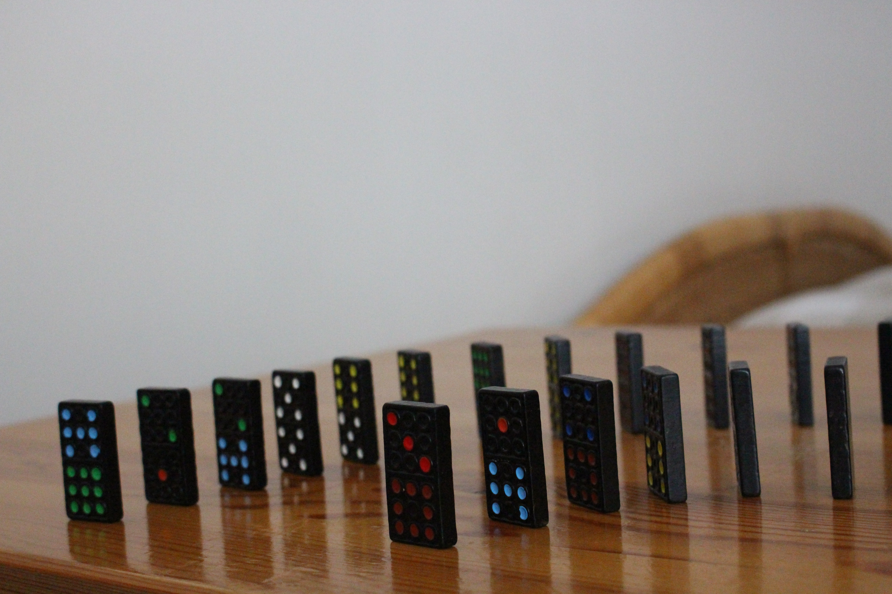
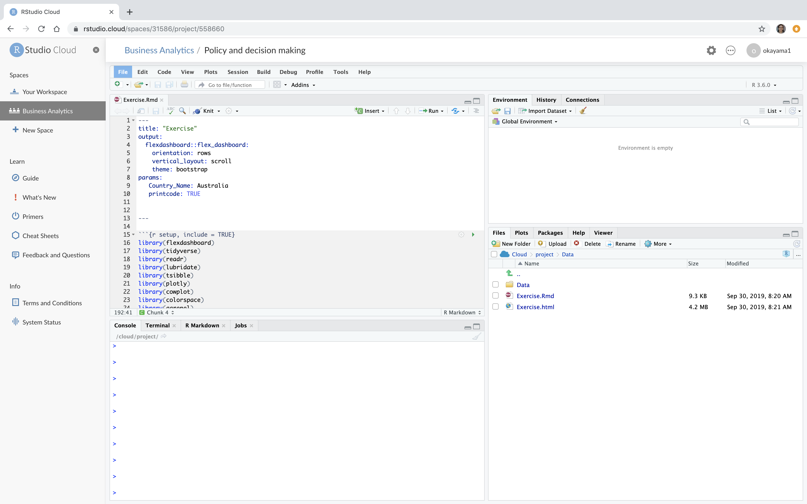

```{r setup, include=FALSE}
options(htmltools.dir.version = FALSE)
```

```{r xaringan-themer, include = FALSE}
#body { font-family: 'Droid Serif', 'Palatino Linotype', 'Book Antiqua', 'Palatino', 'Microsoft YaHei', 'Songti SC', serif; }

# library(xaringanthemer)
# mono_light(
#   base_color = "#23395b",
#   header_font_google = google_font("Josefin Sans"),
#   text_font_google   = google_font('Droid Serif', 'Palatino Linotype', 'Book Antiqua', 'Palatino', 'Microsoft YaHei', 'Songti SC' ),
#   code_font_google   = google_font("Droid Mono"),
#   text_color = "#23395b",
#   text_font_size = 60
# )
# 
# extra_css <- list(
#   ".red"   = list(color = "red"),
#   ".small" = list("font-size" = "100%"),
#   ".full-width" = list(
#     display = "flex",
#     width   = "100%",
#     flex    = "1 1 auto"
#   )
# )

#write_xaringan_theme(title_slide_background_image = "figs/m-master-business-analytics.jpg")


```

class: center, middle


---
class: center, middle
# ETC5513 team

Dr Patricia Menéndez
```{r out.width = '35%', echo = FALSE, fig.align="center"}

```

Lecturer Department of Econometrics and Business Statistics.

Chief Examiner for the unit.


---
class: center, middle
# ETC5513: Teaching team (TAs)

.pull-left[
* Fan Chen, Ph.D. candidate at Monash EBS

]
.pull-left[
```{r out.width = '40%', echo = FALSE, }
knitr::include_graphics("figs/fan.jpg")
```
]

.pull-left[
 * Naveen  Kaushik, Data Scientist, Ventia Pty Ltd.
]
.pull-left[
```{r out.width = '45%', echo = FALSE}
knitr::include_graphics("figs/naveen.png")
```

]


---
# Of course Yourselves too!


.tiny[<span>Photo by <a href="https://unsplash.com/@baim?utm_source=unsplash&amp;utm_medium=referral&amp;utm_content=creditCopyText">Baim Hanif</a> on <a href="https://unsplash.com/?utm_source=unsplash&amp;utm_medium=referral&amp;utm_content=creditCopyText">Unsplash</a></span>]


---
class: left, middle
# Today's Lecture 
.content-box-soft[ 
* Understand the aims and structure of the unit
]

.content-box-soft[ 
* Explain the need for reproducible and collaborative practices
]
.content-box-soft[ 
* Introduce the main tools that we are going to use during the lectures/tutorials
]


---
class: left, top

# ETC5513 Unit Objectives

.green[
1. Develop skills to create reproducible data analyses.
2. Understand the operation of version
control systems.
3. Advace use of version control.
3. Utilise version control to integrate data analysis efforts
of team members.
4. Effectively work with a group to construct a
collaborative data science project.

]
.bold[All that combined with the learning of statistical concepts!]
.content-box-soft[ 
Please .bold[be participative] during the lectures and tutorials. The success of the unit depends not only on the teaching team but also on yourselves as part of the unit's team! ]


---
class: left, top

# ETC5513 program

1.	Course introduction
2.	Reproducible reports using R markdown
3.	Introduction to version control systems: git and GitHub
4.	Reproducible reporting using R markdown, git and GitHub 
5.	Collaborative practices requests and issues
6.	Reproducible and collaborative practices in industry 
7.	Reproducible reporting and version control systems
8.	Workflows for reproducible data analysis
9.	Reproducible reporting for specialized and broad audiences
10.	Advanced collaborative practices 
11.	Reproducible workflows in consultancy
12.	Review and presentations

---
class: center, top

# Unit Structure


.pull-left[
* Start with individual projects 
.tiny[<span>Photo by <a href="https://unsplash.com/@firmbee?utm_source=unsplash&amp;utm_medium=referral&amp;utm_content=creditCopyText">William Iven</a> on <a href="https://unsplash.com/?utm_source=unsplash&amp;utm_medium=referral&amp;utm_content=creditCopyText">Unsplash</a></span>]
]
.pull-left[
```{r out.width = '50%', echo = FALSE}
knitr::include_graphics("figs/william-iven-gcsNOsPEXfs-unsplash.jpg")
```

]

.pull-left[
 * Will continue with group projects
 
 .tiny[<span>Photo by <a href="https://unsplash.com/@homajob?utm_source=unsplash&amp;utm_medium=referral&amp;utm_content=creditCopyText">Scott Graham</a> on <a href="https://unsplash.com/?utm_source=unsplash&amp;utm_medium=referral&amp;utm_content=creditCopyText">Unsplash</a></span>]

]
.pull-left[
```{r out.width = '50%', echo = FALSE}
knitr::include_graphics("figs/helloquence-5fNmWej4tAA-unsplash.jpg")
```


]

.pull-left[
 * Finally, as a class, we will produce a join project
 
 .tiny[<span>Photo by <a href="https://unsplash.com/@baim?utm_source=unsplash&amp;utm_medium=referral&amp;utm_content=creditCopyText">Baim Hanif</a> on <a href="https://unsplash.com/?utm_source=unsplash&amp;utm_medium=referral&amp;utm_content=creditCopyText">Unsplash</a></span>]
]
.pull-left[
```{r out.width = '50%', echo = FALSE}
knitr::include_graphics("figs/baim-hanif-pYWuOMhtc6k-unsplash.jpg")
```

]


---

class: left, middle
## What does that mean?

.content-box-duke-green[
* We'll learn to create reports that will be self contained and reproducible.
]
.content-box-duke-green[
* We'll learn to keep and share the history of an R project using version control systems.
]
.content-box-duke-green[
* We'll learn to work in collaborative projects using reproducible and version control instruments.
]

---
class: left, middle
# Unit structure and resources


## Structure
* 2hr .bold[.green[Interactive lectures]] $\times$  12 weeks
* 1.5hr .bold[.green[Tutorials]] $\times$  12 weeks

## Resources
.content-box-neutral[Moodle]

---
class:  left, top

# Lectures and tutorials  

* The .bold[lectures] will be a combination of presentations with interactive exercises.

   - Each lecture will commence with an  .bold[.green["open frame"]] (5-10min) where students can talk about their learning,
   share comments, issues and resources with the rest of the class. That time can also be used for questions (questions will be welcomed at anytime during the lectures too).

* The .bold[tutorials] will be entirely based on computer practicals and you will be working individually as well as in groups.
  

---
class:  left, top
# Lecture structure


.content-box-neutral[
- Open frame
- Recap from previous lecture
- Summary about lecture's content
- Lecture delivery
]

```{r out.width = '50%', echo = FALSE, fig.align="center"}

```

---
class: left, middle
# Lecturer tips

* Come prepared to be an active learner
* Engage yourself in the lecture
* Share responsibility for learning
* Bring your computer

.green[
 .bold[
Take the challenge, it is going to be fun!
 ]
]


---
class: left, middle
# Tutorials
.green[.bold[Important:] Go over the class material before the tutorial!]
### Goal
* Practice the ideas covered in the lectures by working through activities
and exercises individually and in groups.

### In practice (Please see your tutorial allocation)
.content-box-soft[ 
  - You will get instructions with the tasks that need to be completed during the tutorial.
  - Fan and Naveen will be there to guide and help you through the activities.
  - Tutorials also provide a good opportunity for you to discuss and work with your peers.
]

---
class: center, middle
# Tutorials structure
```{r out.width = '90%', echo = FALSE}

```
---
class: center, middle
# Tutorials structure
```{r out.width = '100%', echo = FALSE}

```


---
class: left, middle
# Assessment


* Tutorials --> .green[5%] which includes:
  - Tutorial quiz submitted via Flux (you will find the link in Moodle) - completed by Thursday 5pm each week.
  - Tutorial attendance.

* 4 Assignments on: 
  - Week 3  .green[15%] 
  - Week 6  .green[20%]
  - Week 9  .green[20%]
  - Week 12 .green[40%] --> Presentation 10% Content 30%

.bold[Total:] 100%

---
class: left, middle
# ETC5513 code of conduct

.content-box-neutral[
* .bold[ Please feel free to ask questions and offering ideas to the group.] 
* All questions, suggestions or comments .bold[are welcomed and must be respected] by the group.
* There is .bold[no] such a thing as a stupid question
* .bold[Remember, while working in teams clarity, organization and communication are extremely important.]
* .bold[Please feel free to let me know about suggestions, problems and/or complains at any time.]
]

.green[The lectures will be recorded and the link to the recordings will appear in Moodle.]


---

class: left, middle
# Lectures and tutorial locations

<br>
- .green[Lectures] online $\rightarrow$ 6:00 - 8:00pm .bold[Tuesdays]
- .green[Tutorials] online/classroom $\rightarrow$ .bold[Please see your allocation]


---

class: left, middle
# Consultation hours

.content-box-soft[ 
- .green[.bold[Patricia]] $\rightarrow$ Fridays 4:00pm - 5:00pm online ]
.content-box-soft[ 
- .green[.bold[Fan]] $\rightarrow$ Thursdays 4:00pm - 5:30pm online]
.content-box-soft[ 
- .green[.bold[Naveen]] $\rightarrow$ Mondays from 5:30pm - 6:15pm online]

**Please see Moodle for Zoom details**

---
class: centre, middle
# Questions


```{r out.width = '80%', echo = FALSE}
knitr::include_graphics("figs/questions.png")
```


---
class:  center, top

# Let's get started


---
class:  left, top

# Motivation for reproducible research
.bold[
 .red[
 What is the problem with that approach?
 ]
]
.pull-left[
.bold[Step 1]
* You carry out your analyses in R, Python or Matlab (using some code)
* You carry out your analyses using excell
]
 .pull-right[
 .bold[Step 2]
* Then you paste your results into your Word document or your latex document or your Page document.

]


---
class:  middle, center
# Critical issue


---
class:  left, middle

# How about?
.content-box-soft[ 
* How about if one parameter or one number changes in your data $\rightarrow$ .bold[GAME OVER]  $\rightarrow$ 
Start all over again :-(!
]
.content-box-soft[ 
* Copy and paste ... 
]
.content-box-soft[ 
* After a week, a month, a year... it is very hard to remember all the steps!
]


---
class:  middle, top

# What is replicable research?

"Research results are
generally considered .green[replicable] if there is sufficient information available for
independent researchers to make the same findings using the same procedures with existing and or new data"


---
class:  left, top

# Replication and literate programming
Lykken [1968] calls “operational replication”:

* .bold[Operational replication] “requires the complete
and open exchange of data, procedures, and materials”. 

* .bold[Literate programming]: Donald Knuth coined the term literate programming in the 1970s to refer to a source file
that could be both run by a computer and “woven” with a formatted presentation document
[Knuth, 1992].


---
class: center, middle
# Literate programming

.content-box-duke-green[
Literate programming is an approach to writing reports using software that weaves together the source code and text at the time of creation. 
]
---
class: left, top
# Reproducible research and replicability

**Definitions by the USA National Academies of Science, Engineering and Medicine**:

- .green[Reproducibility] ("computational reproducibility") means obtaining consistent computational results using the same input data, computational steps, methods, code, and conditions of analysis. 

- .green[Replicability] means obtaining consistent results across studies aimed at answering the same scientific question, each of which has obtained its own data


  
[Refere: Report on reproducibility and replicability](https://www.nap.edu/read/25303/chapter/1#xix)


---

class:  left, top

# Reproducible research

* Working to make your research reproducible does require extra upfront effort.

* Making a project reproducible from the start encourages you to use better
work habits.

* It should push you to bring your data and source code up to a higher
level of quality than you might if you “thought ‘no one was looking’ ” [Donoho,
2010, 386]. 

* Reproducible research needs to be stored so that other researchers can actually access the data and source code. 

* Changes are easier to implement $\rightarrow$ specially when using dynamic reproducible documents.

* Reproducible research has higher impact.


---
class:  left, top
# How? 

Using tools for reproducible research and reporting

```{r out.width = '70%', echo = FALSE, fig.align="center"} 
 knitr::include_graphics("figs/how.jpg") 
```
.tiny[<span>Photo by <a href="https://unsplash.com/@toddquackenbush?utm_source=unsplash&amp;utm_medium=referral&amp;utm_content=creditCopyText">Todd Quackenbush</a> on <a href="https://unsplash.com/s/photos/tools?utm_source=unsplash&amp;utm_medium=referral&amp;utm_content=creditCopyText">Unsplash</a></span>]

---
class:  left, middle
# Dynamic documents

.content-box-green[
* Include code use for data analysis + 
                       report text =
                       Report/Paper
]
All in a .green[sequential] and .green[dynamic way]!


---
class:  middle, center
# Let's start from the begining

.content-box-green[ 
Code?
]

.tiny[<span>Photo by <a href="https://unsplash.com/@markusspiske?utm_source=unsplash&amp;utm_medium=referral&amp;utm_content=creditCopyText">Markus Spiske</a> on <a href="https://unsplash.com/?utm_source=unsplash&amp;utm_medium=referral&amp;utm_content=creditCopyText">Unsplash</a></span>]

```{r out.width = '60%', echo = FALSE} 
 knitr::include_graphics("figs/markus-spiske-GDP_CXFHiuI-unsplash.jpg") 
```


<!-- # .pull-left[ -->
<!-- # .content-box-green[ -->
<!-- # Code? -->
<!-- # ] -->
<!-- # ] -->
<!-- # .pull-right[ -->
<!-- #  -->
<!-- # ```{r out.width = '100%', echo = FALSE} -->
<!-- # knitr::include_graphics("figs/markus-spiske-GDP_CXFHiuI-unsplash.jpg") -->
<!-- ``` -->
<!-- ] -->
---
class:  left, top

# R and Rstudio
.left-column[
```{r out.width = '100%', echo = FALSE}
knitr::include_graphics("figs/1000px-R_logo.svg.png")
```
]

]
.right-column[


]

They are related but they are not the same. Why??


---
class:  left, top
## Tools for reproducible research

* .content-box-soft[ R programing language
]
   - R enables researchers to read data, create data visualizations and run statistical analyses.
   - R has thousands of libraries
   - R has a very active development community that is constantly expanding.
  
  

* .content-box-soft[R libraries/packages --> facilitate reproducibility:
]
     * Knitr and Rmarkdown:
       - Allow us to connect R-based analyses to
presentation, papers and reports documents created with markup languages such as LaTeX and
Markdown


---
class:  left, top
# Rstudio 

* .content-box-soft[ Is an integrated developer environment (IDE): 
]
  - R by itself has the capabilities necessary to gather and analyze data,
and with a little help from knitr/Rmarkdown and markup languages, present
results in a way that is highly reproducible. 


* .content-box-soft[ RStudio allows you to do all of
these things more easily. 
]

  - It also is a happy medium between R’s text-based interface
and a pure GUI. 
  - It is not the only IDE! Examples $\Rightarrow$ Emacs
  - It is closely integrated with the version control programs Git and SVN.
  

*   .content-box-soft[It has a cloud counterpart called .bold[Rstudio Cloud]
]


---
class:  left, middle

# Important distinction

 .content-box-neutral[R is the programming language]

```{r out.width = '100%', echo = FALSE}

```

---
class:  left, middle

.content-box-neutral[Rstudio is an integrated development environment that facilitates R coding and provides a very 
easy interface to connect the work with version control systems.]

```{r out.width = '100%', echo = FALSE}


```


---
# Rstudio Cloud

Rstudio version in the Cloud

```{r out.width = '90%', echo = FALSE}


```

Why??


---
# Rstudio Cloud

- Allows the users to run reproducible reports without the need of installing any additional software or configurations in their own computer. It basically looks exactly like Rstudio but it runs in the cloud and can be loaded using any browser.  

- Rstudio Cloud allows us to work in the same environment
regardless the computer operating system that each of you have in your computers.

- Rstudio will provide the means for us to first focus on learning R and Rstudio without having to worry about installing them locally in each computer (we'll do that later once you are more familiar with the language and the Rstudio environment).


---
class:  middle, top

# Version control

```{r out.width = '60%', echo = FALSE, fig.align= "center"}


```

.tiny[<span>Photo by <a href="https://unsplash.com/@malepics?utm_source=unsplash&amp;utm_medium=referral&amp;utm_content=creditCopyText">Marco Lermer</a> on <a href="https://unsplash.com/?utm_source=unsplash&amp;utm_medium=referral&amp;utm_content=creditCopyText">Unsplash</a></span>]

.bold[.green[Version control is a system that records changes to a file or set of files over time
so that you can recall specific versions later.]]


---
class:  left, top

# Git

"Git is a distributed version-control system for tracking changes in source 
code during software development. It is designed for coordinating work among 
programmers, but it can be used to track changes in any set of files. Its 
goals include speed, data integrity,  and support for distributed, non-linear workflows"

https://en.wikipedia.org/wiki/Git

```{r out.width = '60%', echo = FALSE}
knitr::include_graphics("figs/Git-Logo-Black.png")
```


---
class:  left, top

## Github, Bitbucket and others

.pull-left[
```{r out.width = '100%', echo = FALSE}
knitr::include_graphics("figs/atlassian_Bitbucket_Logo.png")
```
]

.pull-right[
```{r out.width = '100%', echo = FALSE}
knitr::include_graphics("figs/GitHub_Logo.png")
```
]


* Both are cloud-based hosting service that lets you manage Git repositories.

* .green[GitHub/Bitbucket] are code hosting platform for version control and collaboration. It lets you and others work together on projects from anywhere.


---
class:  center, top
# Git and Github

```{r out.width = '60%', echo = FALSE}
knitr::include_graphics("figs/Gitvs.Github-1a.jpg")
```


Source: https://blog.devmountain.com/git-vs-github-whats-the-difference/

---
class:  center, middle
# Course ingredients 

```{r out.width = '70%', echo = FALSE}
knitr::include_graphics("figs/caitlin-mclean-L2iyrw_soPQ-unsplash.jpg")
```

.small[<span>Photo by <a href="https://unsplash.com/@ul01?utm_source=unsplash&amp;utm_medium=referral&amp;utm_content=creditCopyText">Caitlin Mclean</a> on <a href="https://unsplash.com/@ul01?utm_source=unsplash&amp;utm_medium=referral&amp;utm_content=creditCopyText">Unsplash</a></span>]
---
class:  left, top
# Five main tools

.green[
- R
- Rstudio 
- Git 
- Github 
- $+$ one more that I will introduce later :-)
]

.content-box-soft[
During this semester these tools will be essential for us to 
build reproducible and collaborative research practices.
]

---
class:  left, top

# Tutorial

.green[This week the tutorial will focus on providing an introduction to different resources]:

* These slides will be available in Moodle.

* You will also find the tutorial activity for this week.

* Familiarize yourself with all the resources provided in the tutorial and get to know your colleagues (this is quite important!).

* Overview of Rstudio Cloud and an R intro.


---
class:  middle, center

# Looking forward to meeting you all next week!


```{r out.width = '80%', echo = FALSE}

```


<!-- --- -->
<!-- class:  center, top -->
<!-- # Let's get started by opening a project in Rstudio Cloud! -->

<!-- ```{r out.width = '50%', echo = FALSE} -->
<!--  -->
<!-- ``` -->


<!-- - -->
<!-- --- -->
<!-- class:  center, top -->
<!-- # A reproducible project -->

<!-- 1. Please go to the website and log in using your Rstudio cloud loging details -->
<!-- 2. Select project called XXX -->
<!-- 3. Make a local copy in your Rstudio Cloud -->
<!-- 4. Using Knit at the top of the page to run the Rmd file -->

---

```{r endslide, child="endslide.Rmd"}
```


