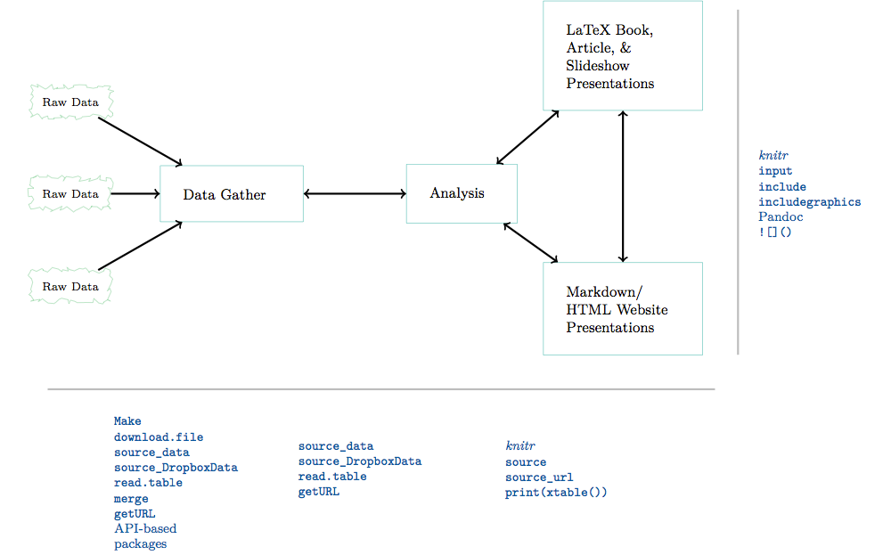
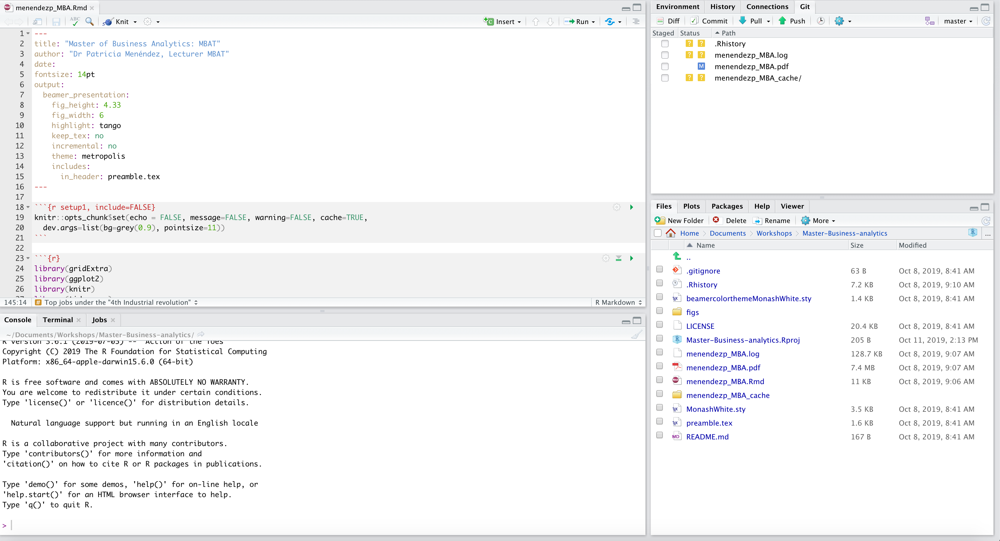
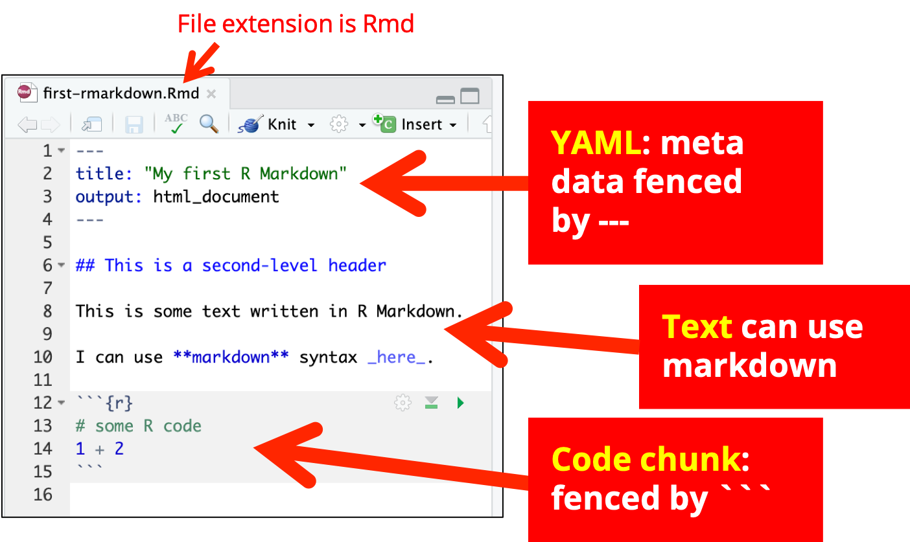
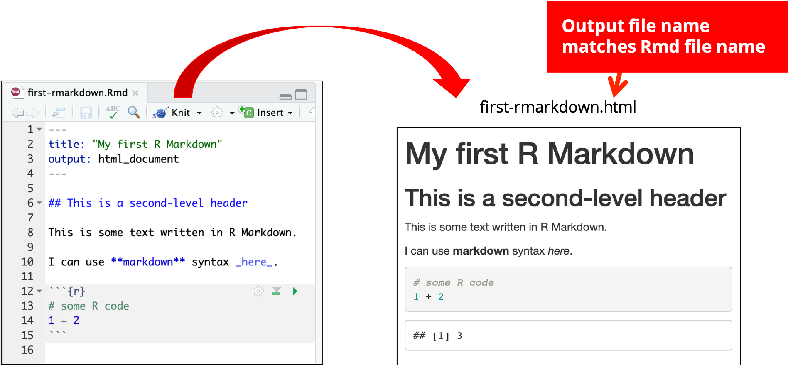
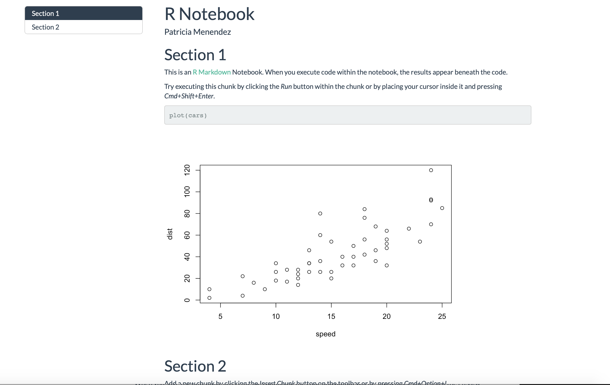
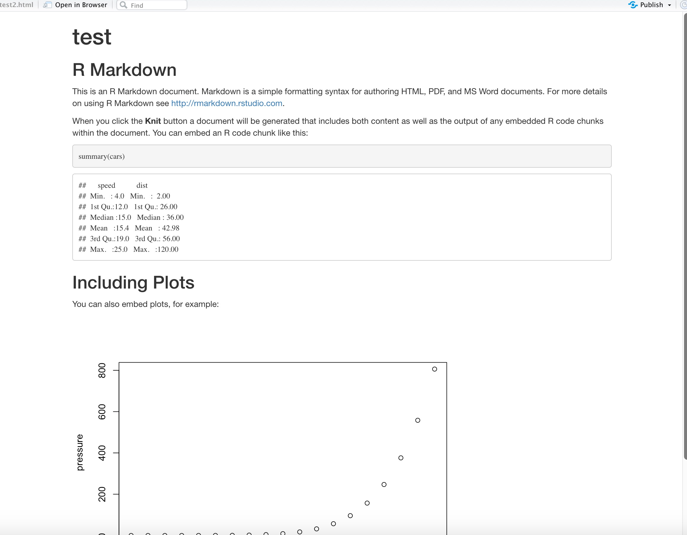
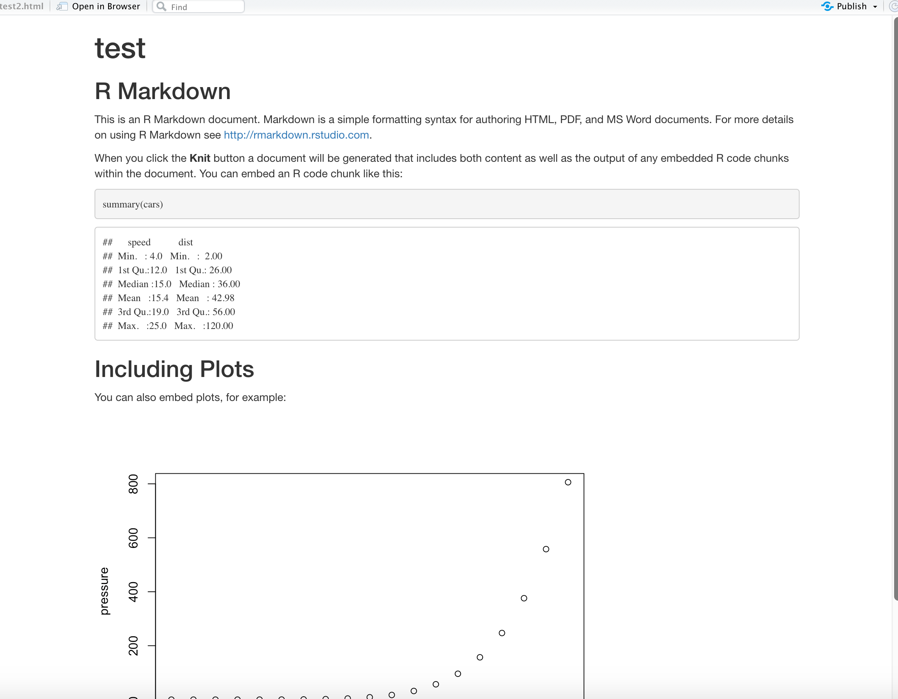
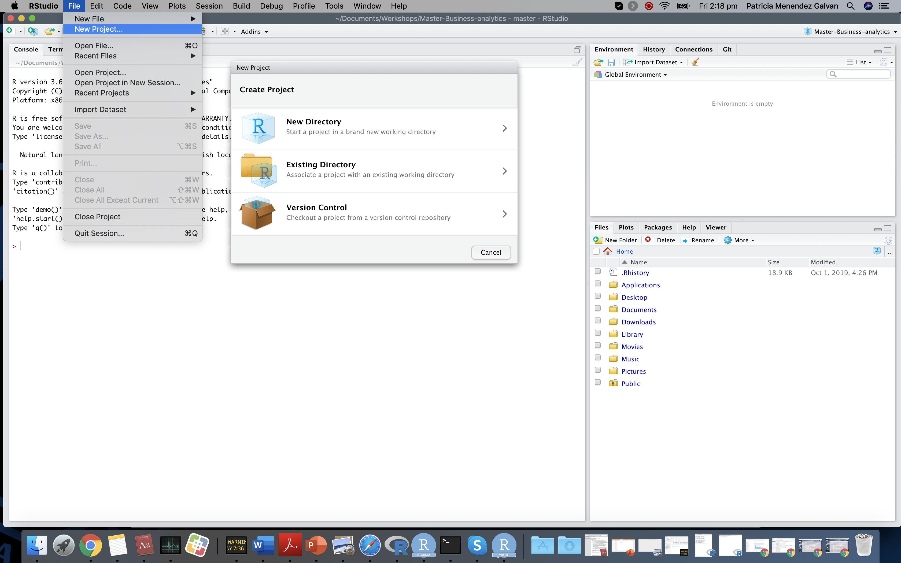

```{r setup, include=FALSE}
options(htmltools.dir.version = FALSE)
```


# Open frame

```{r out.width = '80%', echo = FALSE}
knitr::include_graphics("figs/kelly-sikkema-mdADGzyXCVE-unsplash.jpg")
```

```{r , echo = FALSE }
library(countdown)
library(shiny)

# solarized <- xaringanthemer:::solarized
# countdown(
#   minutes = 0, 
#   seconds = 42,
#   # Fanfare when it's over
#   play_sound = TRUE,
#   # Set timer theme to match solarized colors
#   color_border              = solarized$magenta,
#   color_text                = solarized$magenta,
#   color_running_background  = solarized$cyan,
#   color_running_text        = solarized$base02,
#   color_finished_background = solarized$red,
#   color_finished_text       = solarized$base3
# )

#countdown(minutes = 0, seconds = 7, bottom = 0)


 #countdown(minutes = 0, seconds = 15)
```

---

class: center, middle
# Recap


---
class: left, middle
# Week 1 recap
    1. Set the basis for the unit
    2. Talked about how the unit is going to be organized
    3. Talked about assessment
    4. Briefly instroduced reproducibility
    5. Brief R, Rstudio and git introduction
    6. In the tutorial you got to know 
    more about R and about some of the
    available R and Rstudio resources to
    help you through the semester.
     

---
class:  left, top
# This week (Week 2)
    1. Reproducible reporting
    2. R markdown documents
    3. R code chunks options
    4. Including images and figures
    5. Computer file architecture
    6. R projects
    7. Good coding practices
    
  
  
---
# Reproducibility and Replicability

Definitions by the USA National Academies of Science, Engineering and Medicine:

- .green[Reproducibility] ("computational reproducibility") means obtaining consistent computational results using the same input data, computational steps, methods, code, and conditions of analysis. 

- .green[Replicability] means obtaining consistent results across studies aimed at answering the same scientific question, each of which has obtained its own data


  
[Report on reproducibility and replicability here](https://www.nap.edu/read/25303/chapter/1#xix)


---
class:  middle, center
# Scafolding of reproducible research/reporting

```{r out.width = '80%', echo = FALSE}
knitr::include_graphics("figs/paul-skorupskas-7KLa-xLbSXA-unsplash.jpg")
```

---
# Think about reproducible reporting as a project

The project needs to contain .green[all the resources needed] 
to produce a reproducible output (paper/report)

<br>
.green[Reproducibility] ("computational reproducibility") means 
obtaining consistent computational results using the same input data,
computational steps, methods, code, and conditions of analysis. 
---
# Elements of a reproducible project
 
 - .green[We need to have a plan to organize, store and make the project files available].

 - All the elements of the project should be  files.

- All files should be stored within the project location (typically a folder).

- All your files should be explicitly tied together.


---

# Workflow for reproducible research


```{r out.width = '80%', echo = FALSE, fig.align = TRUE}

```
[Reproducible Research with R and Rstudio by Christopher Gandrud ](http://christophergandrud.blogspot.com/2013/07/getting-started-with-reproducible.html)


---

# Stages for reproducible data analysis and reporting
.content-box-soft[ 
- Clear research question/s to be investigated
]

.content-box-soft[ 
- Clear objectives: What is the goal of this report?
]

.content-box-soft[ 
- Data gathering
]
.content-box-soft[ 
- Exploratory data analysis
]
.content-box-soft[ 
- Data analysis
]
.content-box-soft[ 
- Results presentation
]

.bold[All of the above needs to be documented and tied together!]

---
# ETC5513 

.green[
* .bold[Create reports that are reproducible:]

    + Incorporate analyses that are reproducible
    + Include report text
    + All combined together
]

Our reproducible reports will be created using the scripting language .green[R]
combined with .green[markdown]. 


---
class:  left, top
# What is Markdown? 

.green[Markdown is a lightweight markup language that you can use
to add formatting elements to plaintext text documents.] It was 
created by John Gruber in 2004. [Read more here](https://www.markdownguide.org/getting-started/)

* Markdown is a "text" formatting syntax
* Can be easily render to more complex formats such as:
pdf, html, pdf, doc ...

## Good news!

- We can use markdown inside a type of R documents called R markdown files (Rmd) $\rightarrow$ text can be included and combined with R code.

Today, we'll learn how to do it.


---
class:  left, top
# Markdown example

.pull-left[
.purple[Markdown code]
```markdown
# Header 1
## Header 2

- Unordered list 1 
1. Ordered list 1

 _This is italic._
 
 *This too.*
 
 **This is bold**
 ```
]

.pull-right[
.purple[Render document output]
.content-box-soft[ 
# Header 1
## Header 2

* Unordered list 1 
1. Ordered list 1

_This is italic._

*This too.*

**This is bold**

]
]


---
# Main tool for combinig R code and text

.green[Our main tool is going to be R and its packages] and we are going to use R via Rstudio.

- R is structured in libraries
- For reproducibility we have two libraries that are crucial.
- Does anyone which ones are those?

```{r out.width = '60%', echo = FALSE, fig.align = "center"}

```


---
class:  left, top
# RMarkdown and knitr

* Rmarkdown is a package within R that allows us to create documents using **Markdown**
* Knitr is an R package that allows us to render Rmarkdown code into html, pdf, doc etc ..
.pull-left[
```{r out.width = '50%', echo = FALSE}
knitr::include_graphics("figs/rmarkdown.png")
```

]
.pull-right[
```{r out.width = '50%', echo = FALSE}
knitr::include_graphics("figs/knitr_0.png")
```
]

---
class: left, middle
# R markdown documents 

- R Markdown document is a file format for making dynamic documents with R.
- R markdown documents have extension Rmd

---
class: left, middle
# Dynamic documents 

Rmarkdown + Knitr --> dynamic document

- Rmarkdown allow us to not only use Markdown to write the 
.green[text] in the report, it also allow us to include .green[R code].

- .green[Knitr] with the help of .green[Pandoc] allow us to render documents that contain
a mixed of the components above (text + code)

- .green[Pandoc]  is a universal document converter

- .green[Pandoc] is a  used by the Rmarkdown package to .bold[.green[render]] an 
Rmd file into a new format. For example, an Rmd file can be .bold[.green[render]] into HTML, PDF,
or Microsoft Word file...

- Read more about Pandoc [.bold[here ]](https://pandoc.org)


---
class: center, middle
# Possible outputs


```{r out.width = '60%', echo = FALSE}
knitr::include_graphics("figs/outputs.png")
```
Source: Rstudio

---
class: center, middle
# Rmarkdown file structure

.content-box-soft[ 
Three main components .bold[YAML], .bold[text] and  .bold[R code chunks]
]

```{r out.width = '90%', echo = FALSE}

```

[**More info about Rmarkdown**](https://rmarkdown.rstudio.com)

---
# Rmarkdown anatomy
.green[

* .bold[ Metadata]: It is written in markdown at the top of the file
between '---' in YAML
]


```markdown
---
title: "ETC5513"
author: "Patricia Menendez"
output: html_document
---
```

---
# Rmarkdown anatomy
.green[
* .bold[Text] is written in markdown
]
```markdown
# This is a section header
## This is a subsection header
In this section it is **important**
```
# This is a section header
## This is a subsection header


---
# Rmarkdown anatomy
.green[
* .bold[R code]  chunk definition
]

.pull-left[

```` ```{r X, eval = FALSE} ````

```{r , eval = FALSE} 
library(ggplot2)
ggplot(cars, 
       aes(x = speed, 
           y = dist)
       ) +
  geom_point()
``` 

```` ``` ````
]

.pull-right[
```{r, echo = FALSE}
library(ggplot2)
ggplot(cars, 
       aes(x = speed, 
           y = dist)
       ) +
  geom_point()
```
]


---
class:  left, top
## R code

```{r , eval = FALSE}

library(ggplot2)

data = data(InsectSprays)

head(InsectSprays)
```

--

```{r , eval = FALSE}
ggplot(data = InsectSprays,
       aes(x = spray, y = count, fill = spray)
       ) +
  geom_boxplot(alpha = 0.6
               ) +
  ggtitle("Insect sprays boxplots")

```


---
class:  center, top
## R code output

```{r , echo = FALSE}

library(ggplot2)

data = data(InsectSprays)
```


.pull-left[

```{r ,echo = FALSE}
head(head(InsectSprays))
```
]
.pull-right[

```{r , echo = FALSE}
ggplot(data = InsectSprays,
       aes(spray, count, fill = spray)
       ) +
  geom_boxplot(alpha = 0.6) +
  ggtitle("Insect sprays boxplots")

```
]


---
# R code chunks

You can quickly insert R chunks linto your file with

- the keyboard shortcut .green[Ctrl + Alt + I (OS X: Cmd + Option + I)]
- the .green[Add Chunk]  command in the editor toolbar
- or by typing the chunk delimiters 

### Chunk options
Chunk output can be customized with [knitr options](https://yihui.org/knitr/options/) 
arguments, set inside the R chunk header .green[{r, include = FALSE, echo = FALSE}]:

- .green[include = FALSE] prevents code and results from appearing in the finished file. R Markdown still runs the code in the chunk, and the results can be used by other chunks.
- .green[echo = FALSE] prevents code, but not the results from appearing in the finished file. This is a useful way to embed figures.

---
# More R code chunks

- .green[eval = FALSE] does not evaluate (or run) this code chunk when knitting the Rmd document.
- .green[message = FALSE] prevents messages that are generated by code from appearing in the finished file.
- .green[warning = FALSE] prevents warnings that are generated by code from appearing in the finished.
- .green[fig.cap = "Text"] adds a caption to graphical results.
- .green[fig.align = "center"] set the position of where a figure generated in an R code chunk will appear in the report
_ Plus many more!

<br>
See the [R Markdown Reference Guide (here)](https://rstudio.com/wp-content/uploads/2015/03/rmarkdown-reference.pdf) 
and [knitr options (here)](https://yihui.org/knitr/options/) 
for a complete list of knitr chunk options.


---
# Global options 

To set **global options** that apply to every chunk in your file, call **`knitr::opts_chunk$set()`** in a code chunk. Knitr will treat each option that you pass to `knitr::opts_chunk$set()` .green[.bold[as a global default that can be overwritten in individual chunk headers]].

For example:

**`knitr::opts_chunk$set(echo = FALSE)`**

[More info here](https://yihui.org/knitr/options/) and [here](https://rmarkdown.rstudio.com/lesson-3.html)


---
# Caching
- If document rendering becomes time consuming due to long computations, you can use knitr caching to improve performance. 

- [Read more on R code Chunks options (here)](https://yihui.org/knitr/options/) describes how caching works

- The [cache examples (here)](https://yihui.org/knitr/demo/cache/) provide additional details.

.green[cache = TRUE] is an option within the R code chunks.

More info on caching [here](https://bookdown.org/yihui/rmarkdown-cookbook/cache.html)

---
class:  left, top
# Rmarkdown workflow
```{r out.width = '90%', echo = FALSE}
knitr::include_graphics("figs/rmarkdown_wizards.png")
```


---
class: center, middle
# Example

.pull-left[
```{r out.width = '90%', echo = FALSE}
knitr::include_graphics("figs/first-rmarkdown-code.png")
```
]

.pull-right[
```{r out.width = '90%', echo = FALSE}
knitr::include_graphics("figs/first-rmarkdown-output.png")
```
]


---
class: center, middle
# Knitting an Rmarkdown file to create an html

.content-box-soft[ 
Use knit at the top and select html
]


```{r out.width = '90%', echo = FALSE}

```


---
class: center, middle
# We can also knit a pdf file!

```{r out.width = '90%', echo = FALSE}
knitr::include_graphics("figs/demo-knit-pdf.png")

```

.green[Rendering into pdf requires to have LATEX installed:]
LaTeX is a high-quality typesetting system; it includes features designed for the production of technical and scientific documentation.
---

class: left, middle
# Thanks to knitr and pandoc

.pull-left[
```{r out.width = '80%', echo = FALSE}
knitr::include_graphics("figs/knitr_0.png")
```
]

.pull-right[
Pandoc --> Document converter
https://pandoc.org/index.html

]

.content-box-soft[ 
* knitr executes the code and converts .Rmd to .md
* Pandoc renders the .md file to the output format you want.
]


---

# Let's learn more about YAML

```markdown---
title: "R Notebook"
author: Patricia Menendez
output:
  html_document:
    toc: true
    toc_float: true
    theme: flatly
  word_document:
    toc: true
  pdf_document:
    toc: true
---
```
toc = Table of contents --> 
More resources [here](https://bookdown.org/yihui/rmarkdown/html-document.html)

---
class: center, middle
# This is the output html file

```{r out.width = '100%', echo = FALSE}

```

---
# YAML example 2

```markdown---
title: "test"
output: html_document

---
```


---
class: center, middle
# Corresponding rendered html file

```{r out.width = '60%', echo = FALSE}

```


---
class: left, middle
# Tables and captions

```{r , eval = FALSE}
library(dslabs)

data("murders")

table_data <- head(murders, 5)

knitr::kable(table_data, 
             caption = "Gun murder data
             from FBI reports by state",
             digits = 2)
```
R package .green[knitr] and for more info about function *kable()* 
type .green[?kable] into the R console!

---
class: left, middle
# Tables and captions

```{r , echo = FALSE}
library(dslabs)

data("murders")

table_data <- head(murders, 5)
knitr::kable(table_data, 
             caption = "Gun murder data from FBI by state",
             format ="html")
```

---
class: left, middle
# R Figures and captions


- R figures get created inside the R chunks -->

   + .green[ggplot2]
   
   + .green[tidyverse]
- .green[fig.caption =" This is my caption"] inside the R chunk options


---
class: top, middle
# Inserting external images/photos/figures

.green[Different options:]

```` ```{r out.width = '100%', echo = TRUE} ````

```{r out.width = '80%', echo = TRUE}

```

---
class: left, middle
# Inserting gifs using url's

.green[You can add this in any part of the document other than 
R code chunk -->]

$$


```{r out.width = '40%', echo = FALSE, fig.align= "center"}
knitr::include_graphics("https://media.giphy.com/media/JIX9t2j0ZTN9S/giphy.gif")
```

---
class: inverse
# Now we know how to create an Rmd file

.bold[But there is more to a project than that!]

In a project we have:

- Data
- Possibly other R or Rmd scripts
- figures etc

All the documents related to a project must be in the same folder under an Rstudio project.

.purple[Let's talk about computer paths before moving into R projects]


---
class: center, top

# Computer paths

```{r out.width = '80%', echo = FALSE}
knitr::include_graphics("figs/nathan-anderson-uq5JjGK_4SE-unsplash.jpg")
```

Where are files and folders store in our computer?

---
class: left, top
# Computer Paths

* A _path_ is the complete location or name of where a computer 
file, directory, device, or web page is located.

## Examples

  - .bolder[Windows] $\rightarrow$ .purple[C:\documents\ETC5513]
  - .bolder[Mac/linux] $\rightarrow$ .purple[/Users/documents/ETC5513]
  - .bolder[Internet path] $\rightarrow$ .purple[http://www.google.com]
 


---
class: left, top
# Absolute and Relative Paths

* .bold[Absolute or full path]
An absolute or full path begins with a drive letter followed by a colon, such as D: or /users.
  - Windows: C:\documents\charlie
  - Mac/linux: /Users/documents/courses/ETC5513

* .bold[Relative path]
A relative path refers to a location that is .green[relative to a current directory] (or folder):
  - ETC5513/exercise.Rmd
(no matter where the folder sits things can actually run)
.content-box-soft[ 
It is essential to understand where your directories (folder) and files are within your computer. 
Having clarity about that and the projects file architecture
gives you total control about its organization
]

---
# Order versus mess
.pull-left[

```{r out.width = '80%', echo = FALSE}
knitr::include_graphics("figs/omid-kashmari-s34f0Wxbens-unsplash.jpg")
```


]

.pull-right[

```{r out.width = '80%', echo = FALSE}
knitr::include_graphics("figs/sharon-mccutcheon-tn57JI3CewI-unsplash.jpg")
```


]


---
class:  left, top

#  Work projects

### R work projects

*  .content-box-soft[Each project has a unique working directory]

* .content-box-soft[ Clean file system: all files related to a single project should be in the same folder]
  - data $\rightarrow$ typically is a folder
  - code
  - figures $\rightarrow$ typically is a folder
  - notes

 
* .purple[.bold[File path discipline: all paths should be relative  to the project’s folder]] --> .green[.bold[Why?]]
* Refer to the computer location where files and folders are.
* .red[Remember Absolute paths --> not reproducible]

---
class: left, middle
# Rstudio project example
.green[
*  +  Data folder $\rightarrow$ containing all the data
   +  Images/Figures folder  $\rightarrow$ containing all the images that are not produced within the Rmd file.
   +  .Rproj file
   +  Rmd file
   + R scripts etc...
]


---
class: left, top
# Rstudio projects
Are associated with R working directories.
You can create an RStudio project:
.content-box-soft[ 
* In a brand new directory
* In an existing directory where you already have R code and data
* From a version control repository
]

[Read more on Rstudio projects here](https://support.rstudio.com/hc/en-us/articles/200526207-Using-Projects)

### Inside Rstudio how do we create a new project?

.green[File > New project > (Few options)]


---
# New project in practise

```{r out.width = '100%', echo = FALSE}

```

---
class: left, top
# RStudio projects advantages

When a new project is created RStudio:
.content-box-soft[ 
* Creates a project file (with an .bold[.Rproj] extension) within the project directory.

* This file can also be used as a shortcut for 
  opening the project directly from the filesystem.

* Creates a hidden directory (named .Rproj.user) where project-specific temporary
files (e.g. auto-saved source documents, window-state, etc.) are stored. 

* Loads the project into RStudio and display its name in the Projects toolbar 
]


---
class:  center, top

# Let's talk about good coding style


---
class:  left, top

# Good coding style

* There are different styles and it is important (for various reasons) to be careful about how you 
write your code.

* .bold[Bad example:]
.red[
library(ggplot2)
data = data(InsectSprays)
ggplot(data=InsectSprays, aes(spray, count, fill=spray))+geom_boxplot(alpha=0.6)+ggtitle("Insect sprays boxplots")
]

.content-box-soft[ 
Long lines, no spaces and no structure in the code --> Make it very hard to read and debug!
]
---
# Good example


```{r , eval = FALSE}
library(ggplot2)

ggplot(data = InsectSprays,
       aes(x = spray, y = count, fill = spray)) +
  geom_boxplot(alpha = 0.6) +
  ggtitle("Insect sprays boxplots")
```

 ## Resources
.green[
 In this course we will use the Tidyverse style guide
* https://style.tidyverse.org

* http://adv-r.had.co.nz/Style.html

]
---

# Examples of good coding style
.content-box-soft[ 

* Source code should be readable by humans and self explanatory
]
.content-box-soft[ 

* In general long sentences are not a good idea (max 80-100 characters is a good tradeoff)
]

* .green[For R chunks a good guideline is the Tidyverse style guide]
.content-box-soft[ 
  - Do use spaces: for example around <-, +, =, -, after ',' and before '{'
  
  - For comments use # For the end of line comments and ## for the indented comments
]
.bold[The more organized you are writing your code the easier will be to read it and 
debug it.
]

http://adv-r.had.co.nz/Style.html#undefined


---

# Good practises for reproducible research

* Have a plan to:
     
     - organize, store, and make your files available.
     
* Set up --> .bold[Create an R project for each of your projects] (reports/papers etc...)

.content-box-duke-green[
* Make sure all the steps in your analysis are documented
* All files should be human readable
* All files related to a project must be explicitly tied  together
]


---
class:  left, top
#  Reproducible workflow


Allison Hortt (@allison_horst)


---

```{r endslide, child="endslide.Rmd"}
```


